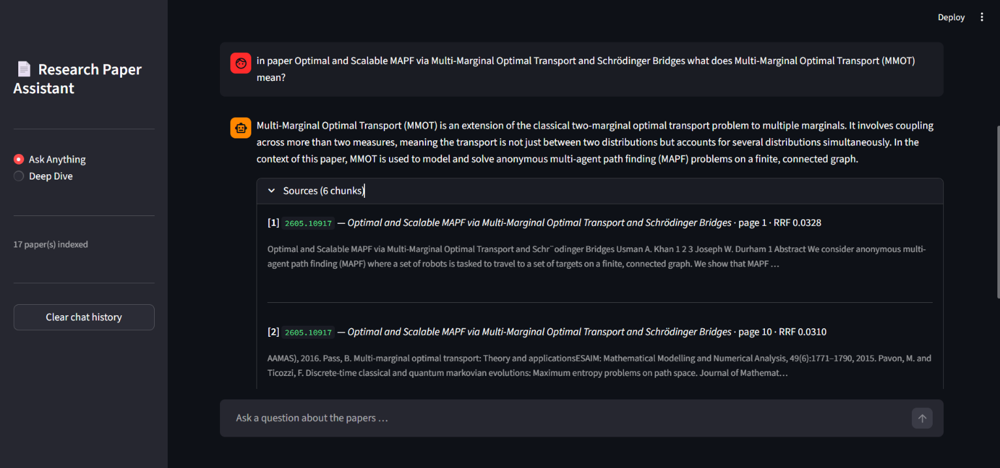
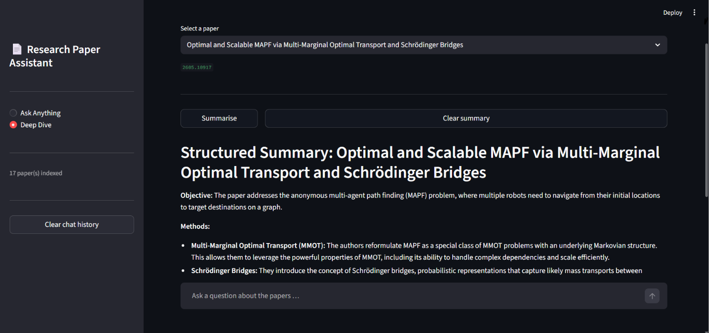

# 📄 Research Paper Assistant

> A fully local AI-powered research assistant built with RAG and Streamlit designed to fetch arXiv papers perform hybrid semantic and keyword-based retrieval and generate intelligent answers or structured research summaries all running entirely on your local machine without relying on cloud APIs or external services

---

## 📸 Streamlit Screenshots

| Ask Anything Mode | Deep Dive Mode |
|:-:|:-:|
|  |  |
---

## 🏗️ Architecture

```
┌─────────────────────────────────────────────────────────────────┐
│                        INGESTION PIPELINE                       │
│                                                                 │
│   arXiv API  ──►  fetcher.py  ──►  parser.py  ──►  indexer.py   │
│                       │               │               │         │
│                  fetch papers    download PDF    FAISS + BM25   │
│                  filter seen     extract text    embed chunks   │
│                  deduplicate     clean + chunk   save to cache  │
│                                                                 │
│                        ingest.py (orchestrator)                 │
└─────────────────────────────────────────────────────────────────┘

┌─────────────────────────────────────────────────────────────────┐
│                         QUERY PIPELINE                          │
│                                                                 │
│   User Query                                                    │
│       │                                                         │
│       ▼                                                         │
│   Intent Detection  ──►  greeting / out-of-scope / research     │
│       │                                                         │
│       ▼                                                         │
│   FAISS Search  ──┐                                             │
│                   ├──►  RRF Fusion  ──►  Ollama LLM  ──►  Answer│
│   BM25 Search   ──┘     (rank merge)      (local)               │
│                                                                 │
│                                                                 │
└─────────────────────────────────────────────────────────────────┘

┌─────────────────────────────────────────────────────────────────┐
│                        STREAMLIT UI                             │
│                                                                 │
│   Sidebar                    Main Panel                         │
│   ├── Mode selector          ├── Ask Anything (Q&A chat)        │
│   ├── Fetch & Ingest btn     └── Deep Dive (paper summary)      │
│   ├── Indexed paper list                                        │
│   └── Clear chat history                                        │
│                                                                 │
│                           app.py                                │
└─────────────────────────────────────────────────────────────────┘
```

---

## 🗂️ Project Structure

```
Paper_RAG/
│
├── app.py              # Streamlit UI with two modes: Ask Anything & Deep Dive
├── config.py           # Single source of truth for all settings
├── fetcher.py          # Queries arXiv API, returns paper metadata
├── parser.py           # Downloads PDFs, extracts & cleans text, chunks
├── indexer.py          # Builds FAISS (dense) + BM25 (sparse) indexes
├── ingest.py           # Orchestrates fetch → parse → index pipeline
├── rag_engine.py       # RRF fusion, intent detection, Ollama generation
│
├── ingested.txt        # Paper IDs already processed (auto-managed)
├── requirements.txt    # Python dependencies
│
├── cache/              # Auto-created: FAISS index + BM25 index files
│   ├── faiss.index
│   ├── faiss_meta.pkl
│   └── bm25.pkl
│
└── pdfs/               # Auto-created: downloaded arXiv PDFs
└── steps.txt           # project steps
```

---

## ⚙️ How It Works

### 1. Fetching
`fetcher.py` queries the arXiv API for the topics defined in `config.py` (`cs.AI`, `cs.LG`, `cs.CL` by default)
 It skips papers already recorded in `ingested.txt` and deduplicates across topics

### 2. Parsing
`parser.py` downloads each paper's PDF to `pdfs/` extracts text page-by-page using PyMuPDF, applies a cleaning pass (removes hyphenation artefacts, page numbers, excess whitespace) then splits the text into overlapping chunks using a recursive character-level splitter that respects paragraph and sentence boundaries

### 3. Indexing
`indexer.py` builds two complementary indexes:
- **FAISS** (`IndexFlatIP`) --> embeds each chunk with `sentence-transformers` and stores normalized vectors for cosine similarity search
- **BM25** (`rank_bm25`)    --> builds a keyword index for exact-term matching

Both indexes are persisted to `cache/` and are additive re-running never wipes existing data

### 4. Retrieval & Generation
`rag_engine.py` handles a query in four steps:
1. **Intent detection** --> classifies as `greeting`, `greeting+question`, `research`, or `out_of_scope`
2. **Dual retrieval**   --> searches both FAISS and BM25 in parallel
3. **RRF fusion**       --> merges ranked lists using Reciprocal Rank Fusion (`score = Σ 1/(k + rank)`)
4. **Generation**       --> builds a context block from top chunks and calls Ollama to generate an answer

---

## 🚀 Setup & Installation

### Prerequisites

- Python 3.10+
- [Ollama](https://ollama.com/) installed and running locally

### 1. Clone the repository

```bash
git clone https://github.com/your-username/paper-rag.git
cd paper-rag
```

### 2. Create a virtual environment

```bash
python -m venv venv

# Windows
venv\Scripts\activate

# macOS / Linux
source venv/bin/activate
```

### 3. Install dependencies

```bash
pip install -r requirements.txt
```

### 4. Pull the Ollama model

```bash
ollama pull aya-expanse
```

> You can use any model supported by Ollama. Update `OLLAMA_MODEL` in `config.py` to match.

### 5. Run the app

```bash
streamlit run app.py
```

---

## 🎛️ Configuration

All settings live in `config.py`. Change a value once and it updates everywhere

| Setting | Default | Description |
|---|---|---|
| `ARXIV_TOPICS` | `["cs.AI", "cs.LG", "cs.CL"]` | arXiv categories to fetch |
| `MAX_PAPERS_PER_TOPIC` | `5` | Papers fetched per topic per run |
| `CHUNK_SIZE` | `600` | Target characters per chunk |
| `CHUNK_OVERLAP` | `80` | Overlap between consecutive chunks |
| `EMBEDDING_MODEL` | `intfloat/multilingual-e5-large` | sentence-transformers model |
| `OLLAMA_MODEL` | `aya-expanse` | Local LLM for generation |
| `TOP_K` | `6` | Chunks returned per query |
| `SCORE_THRESHOLD` | `0.40` | Minimum FAISS cosine similarity |
| `RRF_K` | `60` | RRF constant (higher = softer rank penalty) |

---

## 🖥️ Usage

### Ask Anything
Type any research question in the chat input and the assistant retrieves relevant chunks from all indexed papers and generates a grounded answer with source citations

> **Example queries:**
> - *"In paper Optimal and Scalable MAPF via Multi-Marginal Optimal Transport and Schrödinger Bridges what does   Multi-Marginal Optimal Transport (MMOT) mean?"*


### Deep Dive
Select a specific paper from the dropdown. You can:
- Click **Summarise** to generate a structured summary (Objective / Methods / Results / Limitations)
- Ask targeted questions that are restricted to that paper only

### Fetching New Papers
Click **Fetch & Ingest New Papers** in the sidebar and the pipeline runs automatically and updates both indexes Papers already in `ingested.txt` are skipped

---

## 📦 Key Dependencies

| Package | Purpose |
|---|---|
| `streamlit` | Web UI |
| `sentence-transformers` | Local text embeddings |
| `faiss-cpu` | Dense vector search |
| `rank-bm25` | Sparse keyword search |
| `PyMuPDF` | PDF text extraction |
| `requests` | Ollama API calls |
| `ollama` | Local LLM runner |

---

## 📝 Running the Pipeline from Terminal

You can also run the ingestion pipeline directly without the UI:

```bash
python ingest.py
```

Or test individual components:

```bash
python fetcher.py      # test arXiv fetching
python parser.py       # test PDF parsing on first new paper
python indexer.py      # test indexing + search
python rag_engine.py   # test full RAG pipeline
```

---

## 🔒 Privacy

Everything runs locally:
- No data is sent to external APIs
- PDFs are stored in `pdfs/` on your machine
- Embeddings and indexes are stored in `cache/` on your machine
- The LLM runs via Ollama on `localhost:11434`

---

## 📄 License

MIT License free to use, modify and distribute
